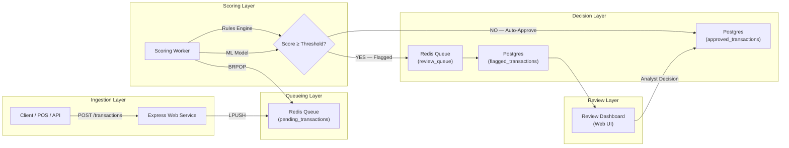
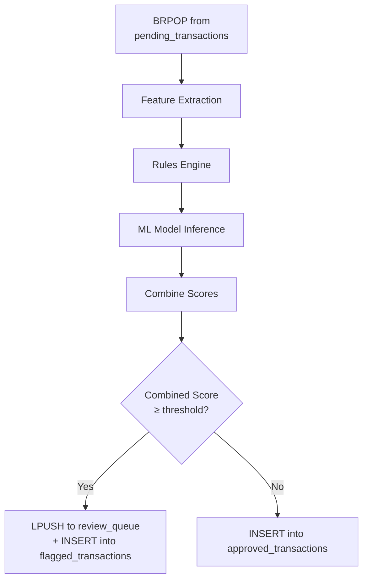
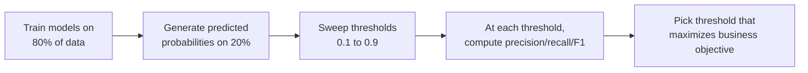
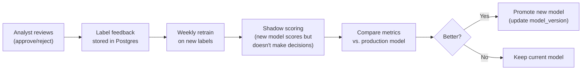

# Real-Time Transaction Fraud/Anomaly Scoring Pipeline

## 1. High-Level Architecture



---

## 2. Component Breakdown

### 2.1 Web Service (Ingest API) — Express/Node.js

| Responsibility | Detail |
|---|---|
| Accept transactions | `POST /api/transactions` — validates payload schema (amount, merchant, card_hash, geo coords, timestamp) |
| Enqueue | Pushes validated transaction JSON into Redis list `pending_transactions` via `LPUSH` |
| Response | Returns `202 Accepted` with a `transaction_id` — the client polls or receives a webhook for the final verdict |
| Health / Metrics | `GET /health`, Prometheus-compatible `/metrics` endpoint for queue depth, latency percentiles |

**Why 202 and not 200?** Fraud scoring is async. Returning immediately decouples ingestion throughput from scoring latency — critical under burst traffic.

---

### 2.2 Redis (Queue + Cache)

| Queue | Purpose |
|---|---|
| `pending_transactions` | Inbound FIFO queue consumed by scoring workers |
| `review_queue` | Flagged transactions awaiting human analyst review |
| `velocity:{card_hash}` | Sorted set — timestamps of recent transactions per card, used for velocity checks (TTL: 24h) |
| `geo:{card_hash}` | Last known geo coordinates, used for geo-mismatch detection |

> [!TIP]
> Redis Sorted Sets with `ZRANGEBYSCORE` make velocity checks O(log N) — you store transaction timestamps as scores and count how many fall within a sliding window.

---

### 2.3 Scoring Worker (Python) — The Brain

This is the most complex component. It runs as a **background process** (or multiple, for horizontal scaling) that continuously pops transactions from Redis and scores them.

#### Scoring Pipeline (per transaction):



#### a) Feature Extraction

Extract features from the raw transaction + Redis state:

| Feature | Source | Description |
|---|---|---|
| `amount` | Transaction payload | Raw transaction amount |
| `amount_zscore` | Computed | How many std devs from this card's mean spend |
| `velocity_1h` | Redis `velocity:{card_hash}` | Transaction count in last 1 hour |
| `velocity_24h` | Redis `velocity:{card_hash}` | Transaction count in last 24 hours |
| `geo_distance_km` | Redis `geo:{card_hash}` + payload | Haversine distance from last transaction location |
| `time_since_last_txn` | Redis `velocity:{card_hash}` | Seconds since previous transaction |
| `is_foreign` | Computed | Merchant country ≠ card issuer country |
| `hour_of_day` | Transaction timestamp | Cyclically encoded (sin/cos) |
| `merchant_category` | Transaction payload | One-hot or label encoded |

#### b) Rules Engine (Deterministic)

Hard rules that **always flag** regardless of ML score:

```python
rules = [
    # Velocity: >5 transactions in 1 hour
    lambda f: f['velocity_1h'] > 5,
    
    # Amount: single transaction > $5,000
    lambda f: f['amount'] > 5000,
    
    # Geo-mismatch: >500km from last transaction within 1 hour
    lambda f: f['geo_distance_km'] > 500 and f['time_since_last_txn'] < 3600,
    
    # Impossible travel: distance/time implies speed > 900 km/h
    lambda f: (f['geo_distance_km'] / max(f['time_since_last_txn'], 1)) * 3600 > 900,
]
```

> [!IMPORTANT]
> Rules fire **independently** of the ML model. If any rule triggers, the transaction is flagged regardless. This provides a safety net for obvious fraud patterns the model might miss.

#### c) ML Model (Probabilistic)

**Model choice: Isolation Forest (primary) + Logistic Regression (secondary)**

| Model | Role | Why |
|---|---|---|
| **Isolation Forest** | Anomaly detection | Unsupervised — catches novel fraud patterns the rules engine doesn't cover. Low latency (~1ms inference). |
| **Logistic Regression** | Supervised classifier | Trained on labeled fraud data (Kaggle Credit Card dataset). Outputs calibrated probability. Interpretable coefficients for compliance audits. |

**Combined score:**

```python
# Weighted ensemble
combined_score = 0.4 * isolation_forest_anomaly_score + 0.6 * logistic_regression_proba

# Threshold (tuned — see Section 4)
THRESHOLD = 0.35
is_flagged = combined_score >= THRESHOLD or any(rule(features) for rule in rules)
```

---

### 2.4 PostgreSQL (Persistent Store)

#### Schema

```sql
-- Core transaction record
CREATE TABLE transactions (
    id              UUID PRIMARY KEY DEFAULT gen_random_uuid(),
    card_hash       VARCHAR(64) NOT NULL,
    amount          DECIMAL(12,2) NOT NULL,
    currency        VARCHAR(3) DEFAULT 'USD',
    merchant_id     VARCHAR(64),
    merchant_category VARCHAR(32),
    latitude        DECIMAL(9,6),
    longitude       DECIMAL(9,6),
    timestamp       TIMESTAMPTZ NOT NULL DEFAULT NOW(),
    status          VARCHAR(16) NOT NULL DEFAULT 'pending',
    -- 'pending', 'approved', 'flagged', 'rejected', 'approved_after_review'
    
    -- Scoring metadata
    rules_triggered TEXT[],           -- e.g., {'velocity_1h', 'geo_mismatch'}
    ml_score        DECIMAL(5,4),     -- combined model score 0.0000–1.0000
    scored_at       TIMESTAMPTZ,
    reviewed_by     VARCHAR(64),      -- analyst who reviewed (if flagged)
    reviewed_at     TIMESTAMPTZ,
    review_notes    TEXT,

    created_at      TIMESTAMPTZ DEFAULT NOW()
);

-- Indexes for common queries
CREATE INDEX idx_transactions_status ON transactions(status);
CREATE INDEX idx_transactions_card_hash ON transactions(card_hash);
CREATE INDEX idx_transactions_timestamp ON transactions(timestamp);
CREATE INDEX idx_transactions_flagged ON transactions(status, scored_at) 
    WHERE status = 'flagged';

-- Audit log for compliance
CREATE TABLE scoring_audit_log (
    id              BIGSERIAL PRIMARY KEY,
    transaction_id  UUID REFERENCES transactions(id),
    feature_vector  JSONB NOT NULL,     -- full feature snapshot for reproducibility
    rules_results   JSONB NOT NULL,     -- {rule_name: bool}
    if_score        DECIMAL(5,4),       -- isolation forest score
    lr_score        DECIMAL(5,4),       -- logistic regression score  
    combined_score  DECIMAL(5,4),
    threshold_used  DECIMAL(5,4),
    decision        VARCHAR(16),        -- 'approved' or 'flagged'
    model_version   VARCHAR(32),        -- for A/B testing & rollback
    created_at      TIMESTAMPTZ DEFAULT NOW()
);
```

> [!NOTE]
> The `scoring_audit_log` stores the **exact feature vector and scores** at decision time. This is non-negotiable for financial compliance — regulators will ask "why was this transaction flagged/approved?" and you must be able to reproduce the exact reasoning.

---

### 2.5 Review Dashboard (Web UI)

A simple but functional analyst interface:

| View | Description |
|---|---|
| **Queue** | Real-time list of flagged transactions, sorted by score (highest risk first) |
| **Detail** | Full transaction context: map showing geo trail, velocity chart, rule triggers, model confidence |
| **Action** | Approve / Reject buttons with mandatory notes field |
| **Analytics** | Daily fraud rate, model precision/recall over time, avg review latency |

---

## 3. Implementation Procedure (Step-by-Step)

### Phase 1: Data & Model Training (Offline)

```
Week 1
├── Download Kaggle Credit Card Fraud Dataset (284,807 transactions, 492 frauds)
├── EDA: understand class imbalance (0.17% fraud rate)
├── Feature engineering pipeline (mirror what the real-time system will compute)
├── Train Isolation Forest (unsupervised — no labels needed)
├── Train Logistic Regression (with SMOTE or class_weight='balanced')
├── Tune threshold on validation set (see Section 4)
├── Export models as pickle/joblib artifacts
└── Document precision/recall/F1 at chosen threshold
```

### Phase 2: Infrastructure Setup

```
Week 2
├── Docker Compose file with:
│   ├── Redis (Alpine, port 6379)
│   ├── PostgreSQL 16 (port 5432)
│   ├── Express API service (port 3000)
│   ├── Python scoring worker
│   └── React/Next.js dashboard (port 3001)
├── Run database migrations (create tables)
├── Seed Redis with test velocity data
└── Health check endpoints for all services
```

### Phase 3: Ingest API

```
Week 2-3
├── Express server with:
│   ├── POST /api/transactions (validate + enqueue)
│   ├── GET /api/transactions/:id (poll status)
│   ├── GET /api/transactions/:id/score (scoring details)
│   └── GET /health
├── Input validation (Joi or Zod schema)
├── Redis connection pool
└── Rate limiting (express-rate-limit)
```

### Phase 4: Scoring Worker

```
Week 3-4
├── Python worker with:
│   ├── Redis consumer (BRPOP loop)
│   ├── Feature extraction module
│   ├── Rules engine module
│   ├── ML inference module (load pickled models)
│   ├── Score combination logic
│   ├── PostgreSQL writer (async via asyncpg)
│   └── Prometheus metrics (scoring_latency, transactions_scored_total)
├── Graceful shutdown handling (SIGTERM)
├── Dead letter queue for failed scorings
└── Horizontal scaling: run N workers with BRPOP (Redis handles distribution)
```

### Phase 5: Review Dashboard

```
Week 4-5
├── React/Next.js frontend
├── API routes for review actions
├── Real-time queue count (Redis pub/sub or polling)
├── Transaction detail view with scoring breakdown
└── Analyst action flow (approve/reject + notes)
```

### Phase 6: Integration Testing & Polish

```
Week 5-6
├── End-to-end test: submit transaction → scoring → flag → review → approve
├── Load testing: simulate burst traffic (k6 or Artillery)
├── Monitor Redis queue depth under load
├── Chaos testing: kill a worker mid-scoring, verify recovery
└── Documentation: README, API docs, architecture diagram
```

---

## 4. Precision/Recall Trade-Off (The Critical Judgment Call)

This is what separates a toy project from production-grade thinking.

### The Fundamental Tension

| Metric | Optimize for... | Risk of over-optimizing |
|---|---|---|
| **Precision** | Don't block legitimate users | More fraud slips through (false negatives) |
| **Recall** | Catch every fraud | More legitimate transactions flagged for review (false positives) |

### The Kaggle Dataset Reality

The Kaggle Credit Card dataset has a **0.17% fraud rate** (492 out of 284,807). This extreme imbalance means:

- A model that predicts "not fraud" for everything gets 99.83% accuracy but **0% recall** — useless.
- Optimizing for recall is more important, but taken to the extreme, you flag everything and your review team drowns.

### How We Tune



### Concrete Numbers (Illustrative from the Kaggle dataset)

| Threshold | Precision | Recall | F1 | False Positive Rate | Practical Impact |
|---|---|---|---|---|---|
| 0.10 | 0.04 | 0.98 | 0.08 | Very High | ~25 legit transactions flagged per fraud caught. Review team overwhelmed. |
| 0.20 | 0.12 | 0.95 | 0.21 | High | ~8 legit flagged per fraud. Manageable with staffing. |
| **0.35** | **0.42** | **0.91** | **0.57** | **Moderate** | **~1.4 legit flagged per fraud. Our chosen operating point.** |
| 0.50 | 0.72 | 0.82 | 0.77 | Low | High precision but missing 18% of fraud — unacceptable financial risk. |
| 0.80 | 0.91 | 0.53 | 0.67 | Very Low | Nearly half of all fraud goes undetected. |

### Why Threshold = 0.35?

> [!IMPORTANT]
> **Business reasoning, not just math:**
> 
> 1. **Recall ≥ 90% is non-negotiable** — missing fraud costs chargebacks ($), regulatory fines, and customer trust.
> 2. **Precision at 0.42 means ~1.4 false positives per true positive** — this is a manageable review load for a small team (a few analysts can handle this).
> 3. **The rules engine acts as a backstop** — even if the ML model misses a fraud (the 9% gap in recall), rules like impossible-travel and velocity limits catch many of those.
> 4. **Combined system recall (ML + rules) is estimated at ~96-98%** — the rules catch fraud patterns the model doesn't, and vice versa.

### Cost-Sensitive Analysis

In production, you'd formalize this with dollar amounts:

```
Cost of missing fraud (false negative):    ~$150 avg (chargeback + investigation)
Cost of flagging legit (false positive):   ~$5 avg (analyst review time + customer friction)

At threshold=0.35:
  Expected fraud caught:     91% × 492 = ~448 frauds
  Expected false flags:      ~628 legitimate transactions
  
  Cost of missed fraud:      44 × $150 = $6,600
  Cost of false flags:       628 × $5 = $3,140
  Total cost:                $9,740

At threshold=0.50:
  Cost of missed fraud:      89 × $150 = $13,350  ← significantly worse
  Cost of false flags:       ~220 × $5 = $1,100
  Total cost:                $14,450
```

**Threshold 0.35 minimizes total expected cost.** This is the kind of analysis that makes interviewers nod.

---

## 5. Production Considerations (Bonus Depth)

### Monitoring & Alerting

| Metric | Alert Threshold | Why |
|---|---|---|
| `pending_queue_depth` | > 1,000 | Workers can't keep up — scale out |
| `scoring_latency_p99` | > 500ms | Model or Redis degraded |
| `flag_rate` | > 5% or < 0.05% | Model drift or data pipeline issue |
| `review_queue_age_max` | > 2 hours | Analysts need help or are offline |

### Model Retraining Loop



### Horizontal Scaling

- **Workers**: Run N Python workers. Redis `BRPOP` naturally distributes — each transaction goes to exactly one worker.
- **API**: Stateless Express servers behind a load balancer.
- **Redis**: Sentinel or Cluster mode for HA.
- **Postgres**: Read replicas for the dashboard; primary for writes.

---

## 6. Tech Stack Summary

| Component | Technology | Port |
|---|---|---|
| Ingest API | Node.js + Express | 3000 |
| Scoring Worker | Python 3.11 + scikit-learn | — (background process) |
| Queue / Cache | Redis 7 | 6379 |
| Database | PostgreSQL 16 | 5432 |
| Dashboard | React (Next.js or Vite) | 3001 |
| Containerization | Docker Compose | — |
| ML Models | scikit-learn (Isolation Forest + Logistic Regression) | — |
| Monitoring | Prometheus + Grafana (optional) | 9090 / 3002 |

---

## 7. Repository Structure

```
prjv/
├── docker-compose.yml
├── README.md
│
├── api/                        # Express ingest service
│   ├── package.json
│   ├── src/
│   │   ├── server.js
│   │   ├── routes/
│   │   │   └── transactions.js
│   │   ├── middleware/
│   │   │   └── validation.js
│   │   └── services/
│   │       └── redis.js
│   └── Dockerfile
│
├── worker/                     # Python scoring worker
│   ├── requirements.txt
│   ├── src/
│   │   ├── main.py
│   │   ├── feature_extraction.py
│   │   ├── rules_engine.py
│   │   ├── ml_scorer.py
│   │   ├── db.py
│   │   └── config.py
│   ├── models/                 # Serialized ML models
│   │   ├── isolation_forest.joblib
│   │   └── logistic_regression.joblib
│   └── Dockerfile
│
├── model-training/             # Offline training notebooks & scripts
│   ├── requirements.txt
│   ├── notebooks/
│   │   └── train_and_evaluate.ipynb
│   ├── scripts/
│   │   └── train.py
│   └── data/
│       └── .gitkeep            # Kaggle dataset downloaded here
│
├── dashboard/                  # React review dashboard
│   ├── package.json
│   ├── src/
│   └── Dockerfile
│
├── db/                         # Database migrations
│   └── migrations/
│       └── 001_initial_schema.sql
│
└── docs/
    ├── architecture.md
    └── precision_recall_analysis.md
```
